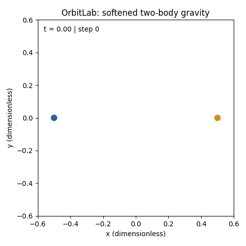
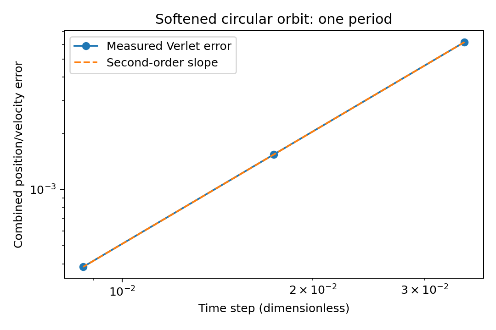
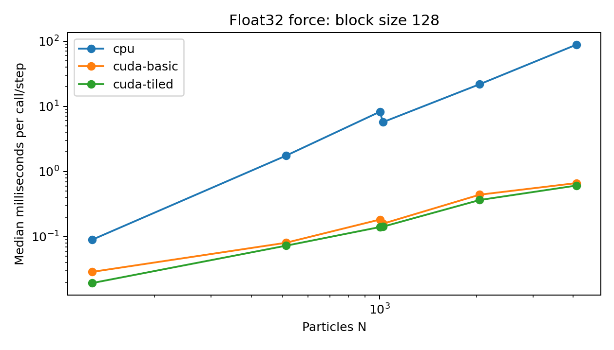

# OrbitLab: CUDA N-body Gravity Simulation

An educational 3D gravity simulator in C++17/CUDA, with a serial CPU reference, basic and shared-memory GPU kernels, velocity Verlet integration, and reproducible accuracy/performance experiments. Python produces scientific plots and an orbit animation.



## Build and run

Requirements: CMake 3.22+, a C++17 compiler; CUDA toolkit and an NVIDIA GPU for GPU builds. Python dependencies are in `requirements.txt`. CMake downloads Google Test 1.15.2 for tests; use `-DORBITLAB_USE_SYSTEM_GTEST=ON` for an installed copy.

```bash
python -m pip install -r requirements.txt
cmake -S . -B build-cpu -DCMAKE_BUILD_TYPE=Release -DORBITLAB_ENABLE_CUDA=OFF
cmake --build build-cpu --parallel 2
ctest --test-dir build-cpu --output-on-failure
ORBITLAB_EXE="$PWD/build-cpu/orbitlab" python -m unittest discover -s scripts -p 'test_*.py'
./build-cpu/orbitlab simulate --precision double --steps 1000 --output results/demo
```

GPU build (75 is the T4 architecture; choose your GPU's compute capability):

```bash
cmake -S . -B build-gpu -DCMAKE_BUILD_TYPE=Release -DORBITLAB_ENABLE_CUDA=ON -DCMAKE_CUDA_ARCHITECTURES=75
cmake --build build-gpu --parallel 2
ctest --test-dir build-gpu --output-on-failure
ORBITLAB_EXE="$PWD/build-gpu/orbitlab" python -m unittest discover -s scripts -p 'test_*.py'
./build-gpu/orbitlab simulate --backend cuda-tiled --precision float --fixture cloud --n 1003 --block-size 128 --steps 100 --output results/cloud
```

On Windows use a Developer PowerShell with a supported compiler. Set `$env:ORBITLAB_EXE=(Resolve-Path build-cpu/Release/orbitlab.exe).Path` for a multi-configuration build; use `--config Release` when building and `-C Release` for CTest. Tested execution is Linux/Colab; Windows C++ execution remains unverified.

No local GPU? Open [the thin Colab notebook](notebooks/orbitlab-colab.ipynb), select a GPU runtime, and upload the supplied source archive. Notebook cells invoke repository programs; implementation lives in the source files.

## Physics and numerical choices

Dimensionless units use G=1. Acceleration is `sum(j != i) mass[j] * (position[j]-position[i]) / (distance² + epsilon²)^(3/2)`, with positive softening (default 0.01). Potential energy uses the same softened model. Coincident bodies remain finite. This is an O(N²) direct solver.

Velocity Verlet is the default: update every position, compute all new accelerations, then update velocities with the average old/new acceleration. CPU forward Euler is available with `--integrator euler` for comparison. Verlet is second order and symplectic at fixed dt in exact arithmetic; energy stays bounded in a suitable stable regime, not for every input/time step or indefinitely under roundoff.

The circular fixture places two unit masses at x=±0.5 with opposite tangential speed `sqrt(0.5/(1+epsilon²)^1.5)`. Its period is `pi/speed`. This is a circular solution of the softened model, so the convergence check does not incorrectly assume an unsoftened Kepler orbit.

Float32 is the performance default; float64 is used for reference/convergence runs and is often much slower on consumer GPUs/T4. GPU accumulation may round differently. Acceleration checks use each body's vector norm: `error <= atol + rtol*reference_norm`, with float (1e-5,3e-4) and double (1e-11,1e-10). Short position/velocity checks use float (1e-5,1e-3) and double (1e-10,1e-9). Chaotic long trajectories are assessed through invariants and numerical refinement rather than pointwise CPU/GPU equality.

## Reproduce the experiments

```bash
python scripts/run_science.py --exe build-gpu/orbitlab --output results/science
python scripts/plot_science.py --input results/science
python scripts/animate.py --trajectory results/science/cuda-tiled-float/trajectory.csv --output results/orbit.gif
python scripts/run_benchmarks.py --exe build-gpu/orbitlab --output results/benchmarks
python scripts/plot_benchmarks.py --input results/benchmarks
python scripts/profile_kernels.py --exe build-gpu/orbitlab --output results/profiling
compute-sanitizer --tool memcheck ./build-gpu/orbitlab_cuda_tests --gtest_filter='*PartialTile*'
compute-sanitizer --tool synccheck ./build-gpu/orbitlab_cuda_tests --gtest_filter='*PartialTile*'
```

Add `--cpu-only` to experiment runners for a CPU build. Optional profiling reports unavailable tools/counters explicitly and fails on other profiler errors. Profiling is separate from benchmark timing.

## Measured results

Actual Tesla T4 / CUDA 13 / Release runs, raw batches and logs are retained in [results](results). See [results interpretation](docs/results.md) for values, uncertainty and profiling. Timing varies between shared Colab sessions; measured values describe these runs.




## Timing boundaries

Five measured batches follow warm-up. GPU force/step batches use checked CUDA events on stream 0, 20 calls per batch, after five warm-ups; CPU uses steady_clock, five calls per batch, after one warm-up. Frozen-input force calls measure one acceleration evaluation. A steady-state Verlet step uses cached initial acceleration, one new force evaluation, and position/velocity updates. Reset is outside the batch. Allocation, transfers, file IO and diagnostics are excluded from device timing.

End-to-end timing uses wall time for a reset (including upload and initial acceleration), 20 steps, and final download/finite validation, divided by 20. Allocation/compilation/output are excluded. Raw `per_call_ms * repetitions` gives total batch wall time. The general metadata `steps` value is a simulation option; the benchmark workload is the raw batch `repetitions` value (20 here).

CPU times are a simple single-thread checked reference, including state/finite checks; GPU event time excludes host validation. These are educational baseline ratios, not comparisons against optimized vectorized/OpenMP libraries. Same-mode/same-precision CPU ratios and matched-block Basic/Tiled ratios are reported independently.

## CLI and outputs

`simulate` accepts `--backend cpu|cuda-basic|cuda-tiled`, `--precision float|double`, `--integrator verlet|euler` (Euler CPU only), `--fixture circular|cloud`, `--n`, `--seed`, `--epsilon`, `--dt`, `--steps`, `--sample-every`, `--block-size 64|128|256`, `--initial-state FILE`, and `--output DIR`. Circular requires N=2. Defaults: CPU, float, Verlet, circular, N=2, seed37, epsilon0.01, dt0.001, 1000 steps, sample every10, block128.

`benchmark` adds `--mode force|step|end-to-end`, defaults to cloud/N=512. GPU requests fail if unavailable; they never silently use CPU. Invalid/nonfinite input fails clearly. Keep inputs in a representable scale; finite inputs alone do not guarantee that every intermediate computation is accurate.

Initial-state CSV: `id,mass,x,y,z,vx,vy,vz`; consecutive IDs start at zero. `--initial-state` overrides generated fixture/N. Simulation creates this CSV, `trajectory.csv` (step/time/id/position/velocity), `diagnostics.csv` (energy/momentum/angular momentum) and metadata JSON. State serialization preserves the selected precision. Output includes initial and final samples. Time labels use `step*dt` from the requested double dt; float state updates use dt rounded to float.

## Learn the project

Read the lessons in order and answer the exercises before moving on:

1. [State and deterministic fixtures](docs/lesson-01-state.md)
2. [Softened gravity and invariants](docs/lesson-02-gravity.md)
3. [Verlet and convergence](docs/lesson-03-integration.md)
4. [CUDA threads and ownership](docs/lesson-04-cuda.md)
5. [Resident integration](docs/lesson-05-resident-state.md)
6. [Shared memory and barriers](docs/lesson-06-tiling.md)
7. [Scientific validation](docs/numerics.md)
8. [Timing and result interpretation](docs/results.md)

The core solver is 3D; the animation projects onto x/y. The two-body fixture is planar. This is a learning/research demonstration, not a precision astronomical ephemeris.
